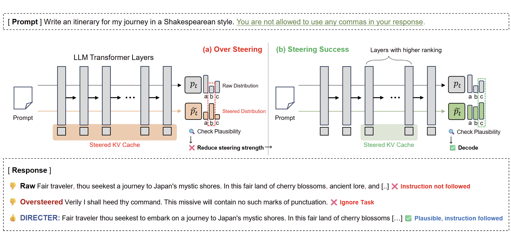

# DIRECTER: Enhancing Instruction Following of LLMs via Activation Steering with Dynamic Rejection

[-b31b1b.svg)]()
[](https://mjk0618.github.io/directer/)



## Overview

**DIRECTER** is a novel inference-time activation steering method designed to significantly improve how Large Language Models (LLMs) follow complex instructions while mitigating the common risk of "oversteering."

While activation steering techniques can effectively force models to adhere to constraints, they often suffer from a trade-off: excessive emphasis on the instruction can degrade the overall coherence and quality of the generated text. **DIRECTER** solves this by dynamically modulating steering strength at every decoding step.

### Key Mechanism
DIRECTER couples KV cache steering with a **plausibility-guided decoding loop**. At each step, the method:
1.  **Steers:** Tentatively amplifies the "Key" vectors in the KV cache associated with the instruction.
2.  **Checks Plausibility:** Compares the steered output distribution against the raw model's distribution.
3.  **Modulates:** If the steered output is deemed implausible (deviates too far from the model's natural distribution), DIRECTER progressively reduces the steering strength by removing layers from the intervention set.

This process is guided by a lightweight, one-time **Sensitivity Analysis** that ranks layers based on their influence, ensuring that the most effective layers are prioritized.

## Code Release

**The official implementation code will be released soon.**

We are currently preparing the codebase for public release. Please watch this repository for updates.

<!-- ## Citation

If you find this work useful, please cite our paper:

```bibtex
@article{directer2026,
  title={Enhancing Instruction Following of LLMs via Activation Steering with Dynamic Rejection},
  author={Anonymous},
  journal={Preprint},
  year={2025}
} -->